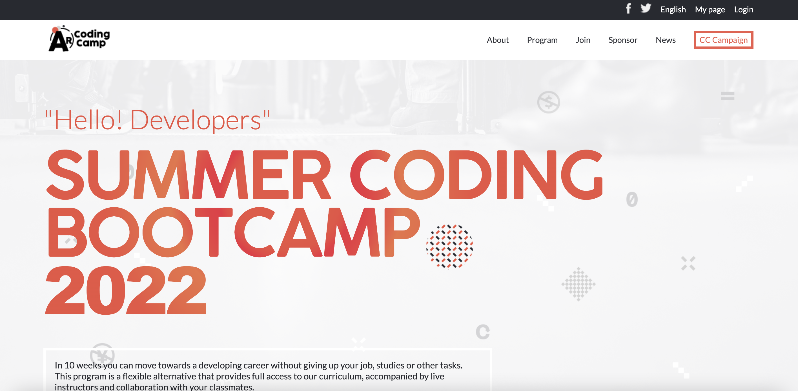
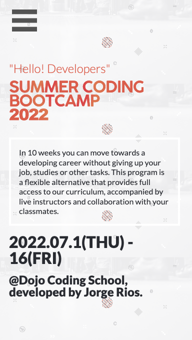

# Capstone Project

> In this project I build page for a conference using HTML, CSS and JavaScript.

## Built With

- Major languages
-- HTML, CSS, JavaScript
- Frameworks
-- Visual Studio Code

## Getting Started

To get a local copy up and running follow these simple example steps.

### Prerequisites
- Pc with any OS.
- IDE

### Live Demo
For live demo [clic here](https://alexr16.github.io/Conference-page/).
## Author

👤 **Jorge Rios**

- GitHub: [@Alexr16](https://github.com/Alexr16)
- Twitter: [@ReveloJ](https://twitter.com/ReveloJ)
- LinkedIn: [Jorge Ríos](https://www.linkedin.com/in/jorge-r%C3%ADos-3b33ab22b)

## 🤝 Contributing

Contributions, issues, and feature requests are welcome!

Feel free to check the issues page.

## Acknowledgments

- Original design idea by Cindy Shin in Behance.

## Show your support

Give a ⭐️ if you like this project!

## 📝 License

This project is [MIT](./MIT.md) licensed.
